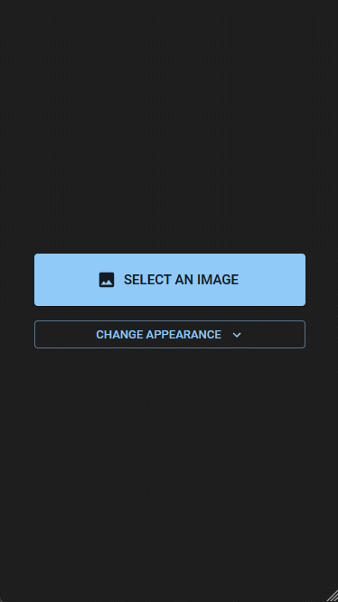

# hidden

PWA that is a wrapper for [hidden-api](https://github.com/thepmsquare/hidden-api) which provides plain-text encryption on top of steganography using AES. [Reference for Advanced Encryption Standard](https://en.wikipedia.org/wiki/Advanced_Encryption_Standard).

Implementation of steganography using the least significant bits of the RGB values of an image.

## Supported formats

### input

- PNG
- JPEG

Note: APNG or other animated image inputs will have unintended transformations in the encoded image.

### output

- PNG

Note: Output image will be in RGB / RGBA color modes only.

## built on

- NodeJS v18.15.0
- npm v9.5.0

and more inside `package.json`

### Feedback is appreciated. Thank you!
